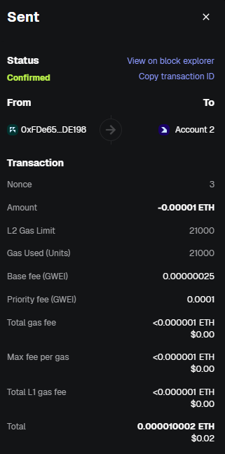
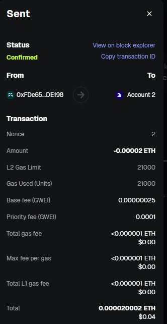

# blockchain

# Blockchain Tasks

## Task 1 — Wallet
**My address:** `0xfde65c6fa91be5669712f51e0471cd20c22de198`

## Task 2 — Chains
**Incoming transaction:** [link](https://sepolia.etherscan.io/tx/0xad08e3c8cdb63ae6e997ef0dcf100f84709a0de62558400193b977c7d23113d7)

## Task 3 — Transactions
**Transaction link:** [link](https://sepolia-optimism.etherscan.io/tx/0x9898ec829093be2d687afd78ebf81bd90fb85fc8ea9ad49a90debc047677c0eb)

## Task 4 — Gas
**OP Mainnet Gas Tracker:** [link](https://optimistic.etherscan.io/gastracker)

## Task 5 — Nonce
**Transaction 1 (skipped nonce):** [link](https://sepolia-optimism.etherscan.io/tx/0x65e3bc85f4f9946c6dc69a3dababa42d67efecc0e9056bb3b0312e11dca99112)  
**Transaction 2 (default nonce):** [link](https://sepolia-optimism.etherscan.io/tx/0x1eb3d52f2ff71971a46c3b0a12a1daa973ae7e75299542e4249a7f6b73b1bdbe)

### Activity Log Screenshots
**Transaction 1:**  

**Transaction 2:**  

